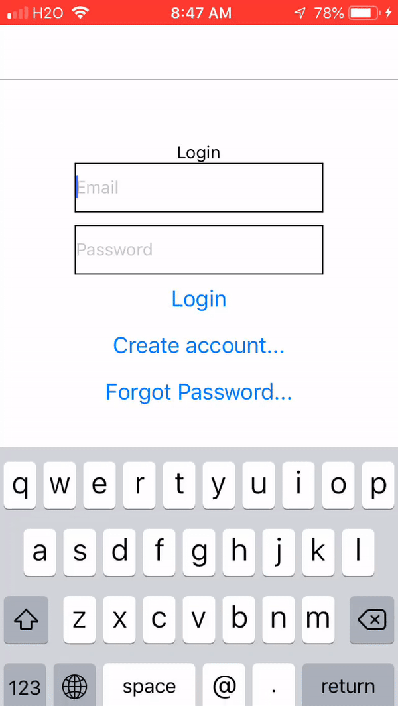

Example redux with firebase app from [this article](https://itnext.io/simple-firebase-redux-integration-in-react-native-32f848deff3a).

# Step 1 setup project
```
expo init todoapp2 --template blank@sdk-32 --yarn
cd expo
yart add -S redux react-navigation redux react-redux redux-thunk firebase
```

# Step 2 setup firebase
Create a `constants/ApiKeys.js` file and put your actual firebase config values:
```
export default {
  FirebaseConfig: {
    apiKey:      "",
    authDomain:  "",
    databaseURL: "",
    projectId: "",
    storageBucket: "",
    messagingSenderId: ""
  }
}
```

# Step 3 copy code
The code in the [example repo](https://github.com/ProProgramming101/expo-firebase-redux-starter) is outdated. Modernize it with newer versions of packages.

$ Step 3 run
`yarn start`


